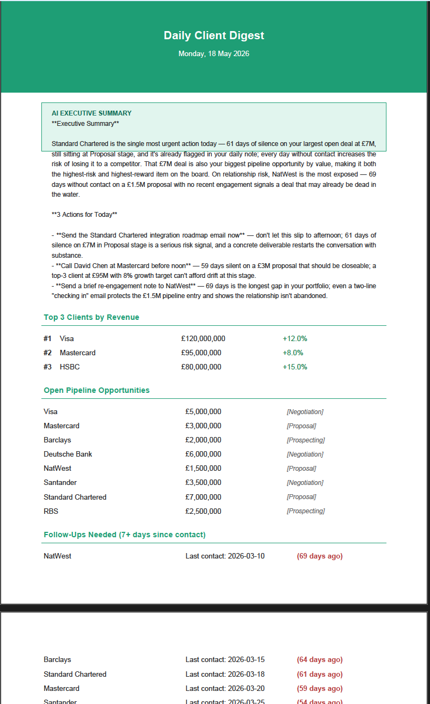
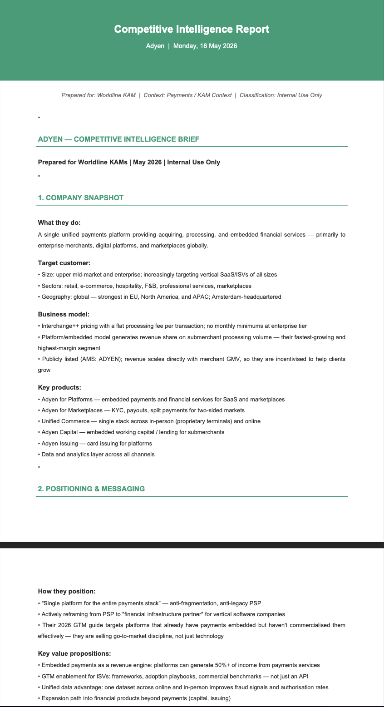

# AI Automation Toolkit — Shikhar Srivastava

A suite of AI-powered Python agents built to automate client intelligence, meeting preparation, and competitive research for enterprise account management. Built in 4 weeks by a Senior KAM with no prior coding experience.

> **Stack:** Python · Claude (Anthropic) · fpdf2 · Gmail SMTP · Obsidian

---

## What this does

One command every morning runs the full pipeline:

```bash
python3 morning_briefing.py
```

- Reads live client data from CSV sources
- Pulls context from an Obsidian knowledge base
- Generates an AI executive summary via Claude
- Exports a styled PDF digest
- Emails it automatically
- Optionally generates a meeting prep sheet for any client

---

## Tools

| Script | What it does |
|---|---|
| `morning_briefing.py` | **Flagship** — runs the full morning pipeline in one command |
| `digest_agent.py` | Reads 3 CSVs, outputs daily client briefing to terminal |
| `export_pdf.py` | Exports digest, meeting prep, and intel reports to styled PDF |
| `send_email.py` | Sends digest and prep PDFs via Gmail SMTP automatically |
| `meeting_prep.py` | Type a client name → get full prep sheet + Claude.ai talking points → PDF |
| `competitive_intel.py` | Paste competitor data or URL → structured 6-section intel report → PDF |
| `obsidian_brain.py` | Reads Obsidian vault → query your own notes with natural language via Claude |

---

## Sample outputs

### Daily Client Digest


```
============================================================
  📋  DAILY CLIENT DIGEST — Monday, 18 May 2026
============================================================
  📈  TOP 3 CLIENTS BY REVENUE
  #1 Visa                   £ 120,000,000  🟢 12.0% growth
  #2 Mastercard             £  95,000,000  🟢  8.0% growth
  #3 HSBC                   £  80,000,000  🟢 15.0% growth

  🔄  OPEN PIPELINE OPPORTUNITIES
  Standard Chartered        £ 7,000,000  [Proposal]
  Deutsche Bank             £ 6,000,000  [Negotiation]
  Visa                      £ 5,000,000  [Negotiation]

  📞  FOLLOW UPS NEEDED (7+ days)
  NatWest     Last contact: 2026-03-10  (69 days ago)
  Barclays    Last contact: 2026-03-15  (64 days ago)
============================================================
```

### AI Executive Summary (Claude-generated)
> *"Standard Chartered is your most urgent priority — 61 days silent on a £7M proposal that is at serious risk of going cold. Your biggest pipeline opportunity is the same deal: push it from Proposal to Negotiation this week. The relationship most at risk beyond Standard Chartered is NatWest at 69 days silent with £1.5M in Proposal stage."*

### Meeting Prep Output
```
============================================================
  📋  MEETING PREP — Standard Chartered
============================================================
  💰  Revenue:        £73,000,000  (+16.0% growth)
  🎯  Pipeline:       £7,000,000  [Proposal]
  📞  Last Contact:   2026-03-18  (61 days ago)
  📈  Growth Target:  16%
============================================================
```

### Competitive Intel Report (6 sections)


- Company Snapshot
- Positioning & Messaging
- Strengths
- Weaknesses & Gaps
- Counter-Moves for Worldline KAMs
- Watch List (next 90 days)

---

## Impact

- **~7 hours/month** saved on manual client prep
- **100% of portfolio** reviewed daily vs reactive ad-hoc checks
- Meeting prep time reduced from **45 mins to 5 mins** per client
- Competitive intel reports generated in **under 10 minutes**

---

## Setup

```bash
# Install dependencies
pip3 install fpdf2 pandas requests beautifulsoup4

# Run the morning briefing
python3 morning_briefing.py

# Run meeting prep
python3 meeting_prep.py

# Run competitive intelligence
python3 competitive_intel.py

# Query your Obsidian brain
python3 obsidian_brain.py
```

### Requirements
- Python 3.10+
- Gmail account with App Password configured
- Obsidian vault (optional — for enriched AI summaries)
- Claude.ai account (free or Pro) for AI intelligence layer

---

## Data sources

The toolkit reads from 3 CSV files:

| File | Contents |
|---|---|
| `clients.csv` | Pipeline value, deal stage, growth targets |
| `revenue.csv` | Revenue figures and growth % |
| `last_contact.csv` | Last contact dates per client |

---

## Week 1 learning scripts

| Script | What it does |
|---|---|
| `hello.py` | Hello World |
| `input_test.py` | User input handling |
| `guess_number.py` | Number guessing game |
| `top_clients.py` | Reads CSV, prints top 3 clients by revenue |
| `dicts.py` | Python dictionaries practice |

---

## About

Built by **Shikhar Srivastava** — Senior Key Account Manager at Worldline, building AI agents to automate how enterprise revenue teams operate.

- 🔗 [LinkedIn](http://www.linkedin.com/in/shikhar-srivastava-b292841a)
- 💼 Managing a £7.29M gross revenue portfolio across 20 key clients
- 🤖 Building AI automation tools in Python using Claude (Anthropic)
- 🚀 Exploring how AI transforms enterprise account management at scale
